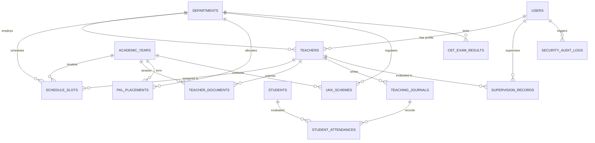

# DOKUMENTASI LENGKAP & BUKU PANDUAN SISTEM
# SIMKUR — Sistem Informasi Manajemen Kurikulum SMK Terpadu
**Digitalisasi Single Command Center Waka Kurikulum, Tata Usaha, dan Ekosistem Akademik Kejuruan**  
*Selaras Regulasi Nasional: Permendikbudristek No. 12/2024 jo. Permendikdasmen No. 13/2025, Standar Proses Permendikdasmen No. 1/2026, dan UU Perlindungan Data Pribadi (UU PDP) No. 27/2022*

---

| Parameter Dokumen | Keterangan Rinci |
| :--- | :--- |
| **Nama Aplikasi** | **SIMKUR SMK** (Sistem Informasi Manajemen Kurikulum) |
| **Versi Rilis** | **v3.1.5 (Production-Ready Architecture)** |
| **Target Satuan Pendidikan** | SMK Negeri 1 Banjarmasin (NPSN 30304268) — 5 Jurusan, 45 Rombel, 1.564 Siswa, 118 GTK |
| **Fokus Pengguna Utama** | Wakil Kepala Sekolah Bidang Kurikulum (Waka Kurikulum) & Operator TU |
| **Pengguna Terintegrasi** | Kepala Sekolah, Kepala Program Keahlian (Kajur), Guru Mata Pelajaran, Asesor UKK DUDI |
| **Tahun Ajaran Aktif** | **2026/2027 Semester Genap** (Penerapan Penuh Kurikulum Merdeka) |
| **Status Lisensi LSP** | Lisensi BNSP Nasional (**BNSP-LSP-892-ID**) & Kemitraan 42 DUDI |

---

## DAFTAR ISI
1. [Ringkasan Eksekutif & Visi Sistem](#1-ringkasan-eksekutif--visi-sistem)
2. [Landasan Hukum & Regulasi Kurikulum Merdeka 2026](#2-landasan-hukum--regulasi-kurikulum-merdeka-2026)
3. [Arsitektur Sistem & Spesifikasi Teknologi](#3-arsitektur-sistem--spesifikasi-teknologi)
4. [Matriks Peran & Hak Akses (Role-Based Access Control / RBAC)](#4-matriks-peran--hak-akses-role-based-access-control--rbac)
5. [Dokumentasi Fungsional 11 Modul Utama](#5-dokumentasi-fungsional-11-modul-utama)
   - [Modul 6.1: Overview Dashboard & Single Command Center](#modul-61-overview-dashboard--single-command-center)
   - [Modul 6.2: Struktur Kurikulum & Sinkronisasi DUDI](#modul-62-struktur-kurikulum--sinkronisasi-dudi)
   - [Modul 6.3: Pengelolaan & Verifikasi Perangkat Ajar Guru](#modul-63-pengelolaan--verifikasi-perangkat-ajar-guru)
   - [Modul 6.4: Jadwal PTM Anti-Bentrok & Beban Mengajar (JJMS)](#modul-64-jadwal-ptm-anti-bentrok--beban-mengajar-jjms)
   - [Modul 6.5: Portal Mandiri Guru, Jurnal Deep Learning & Roll-Call Presensi](#modul-65-portal-mandiri-guru-jurnal-deep-learning--roll-call-presensi)
   - [Modul 6.6: Supervisi Akademik & Observasi Kelas Berbasis Coaching](#modul-66-supervisi-akademik--observasi-kelas-berbasis-coaching)
   - [Modul 6.7: Manajemen CBT & Analisis Ketuntasan KKTP](#modul-67-manajemen-cbt--analisis-ketuntasan-kktp)
   - [Modul 6.8: Monitoring PKL 6 Bulan & Evaluasi Kemitraan DUDI](#modul-68-monitoring-pkl-6-bulan--evaluasi-kemitraan-dudi)
   - [Modul 6.9: Uji Kompetensi Keahlian (UKK) Dual-Track & BNSP](#modul-69-uji-kompetensi-keahlian-ukk-dual-track--bnsp)
   - [Modul 6.10: Pelaporan Dinas & Dashboard Eksekutif](#modul-610-pelaporan-dinas--dashboard-eksekutif)
   - [Modul 6.11: Panel Kontrol Admin Kurikulum & Operator TU](#modul-611-panel-kontrol-admin-kurikulum--operator-tu)
6. [Struktur Basis Data & Kamus Data (14 Tabel MySQL)](#6-struktur-basis-data--kamus-data-14-tabel-mysql)
7. [Audit Keamanan, Celah SQL Injection & UU PDP No. 27/2022](#7-audit-keamanan-celah-sql-injection--uu-pdp-no-272022)
8. [Panduan Instalasi & Deployment Server (aaPanel / Linux)](#8-panduan-instalasi--deployment-server-aapanel--linux)
9. [Standar Operasional Prosedur (SOP) & Panduan Pengguna](#9-standar-operasional-prosedur-sop--panduan-pengguna)

---

## 1. RINGKASAN EKSEKUTIF & VISI SISTEM

Sebelum SIMKUR diimplementasikan, administrasi akademik di SMK menghadapi kendala fragmentasi data yang parah:
- Penjadwalan pelajaran 45 rombel disusun manual di Excel sehingga sering terjadi bentrok guru dan ruang lab.
- Perangkat ajar (Modul Ajar/ATP) dikumpulkan lewat WhatsApp atau cetak kertas yang menumpuk tanpa standarisasi.
- Nilai UKK dan sertifikasi profesi terpecah antara skema LSP-P1 BNSP dan sertifikat industri mitra.
- Data pemenuhan beban mengajar 24 JP guru sering tidak klop saat disinkronkan ke aplikasi Dapodik, mengakibatkan keterlambatan pencairan Tunjangan Profesi Guru (TPG/Sertifikasi).

**SIMKUR hadir sebagai Single Command Center Digital** yang menyatukan seluruh siklus manajemen kurikulum SMK dalam satu dashboard terintegrasi:
```
  [ PERENCANAAN ]            [ PELAKSANAAN ]             [ PENILAIAN & UJI ]          [ AKUNTABILITAS ]
  Struktur Kurikulum  ───►  Jadwal Anti-Bentrok  ───►  CBT & KKTP Formatif  ───►  Laporan Cabang Dinas
  Sinkronisasi DUDI   ───►  Jurnal Deep Learning ───►  Monitoring PKL (6 Bln)───►  Dashboard Kepsek
  Verifikasi Modul    ───►  Presensi Siswa PTM   ───►  UKK Dual-Track BNSP  ───►  Audit Trail UU PDP
```

---

## 2. LANDASAN HUKUM & REGULASI KURIKULUM MERDEKA 2026

Pengembangan SIMKUR telah diselaraskan 100% dengan kerangka regulasi nasional per 2026:

1. **Permendikbudristek No. 12 Tahun 2024:**
   Menetapkan Kurikulum Merdeka sebagai kurikulum nasional PAUD, Dikdas, dan Dikmen. Menetapkan struktur pembelajaran berbasis Fase E (Kelas X) dan Fase F (Kelas XI & XII), serta kewajiban Praktik Kerja Lapangan (PKL) minimal 6 bulan (1 semester) untuk SMK 3 tahun.
2. **Permendikdasmen No. 13 Tahun 2025:**
   Mengatur perubahan struktur kurikulum dan alokasi jam pelajaran (JP) untuk Tahun Ajaran 2026/2027. Mengelompokkan mata pelajaran ke dalam Kelompok Umum (A), Kelompok Kejuruan (B: Dasar Kejuruan, Konsentrasi Kejuruan, Mapel Pilihan), dan Projek Penguatan Profil Pelajar Pancasila (P5).
3. **Permendikdasmen No. 1 Tahun 2026 tentang Standar Proses:**
   Menetapkan prinsip pembelajaran modern berbasis **Deep Learning** (*Meaningful, Mindful, Joyful*) dan pembelajaran berdiferensiasi. Menghilangkan beban administratif kaku Modul Ajar dan mengarahkan supervisi akademik menjadi **dialog reflektif / coaching**.
4. **Permendikbud No. 15 Tahun 2018 jo. Juknis GTK 2026:**
   Kewajiban pemenuhan beban kerja guru minimal 24 Jam Pelajaran (JP) dan maksimal 40 JP tatap muka per minggu untuk kevalidan data Info GTK.
5. **Pedoman Penyelenggaraan UKK Direktorat SMK & BNSP (Peraturan BNSP No. 5/BNSP/VII/2014):**
   Standarisasi penyelenggaraan UKK dual-track melalui LSP-P1 (Lisensi BNSP dengan Sertifikat Garuda Emas) dan Uji Mandiri bersama Mitra Industri DUDI terakreditasi.
6. **Undang-Undang No. 27 Tahun 2022 tentang Perlindungan Data Pribadi (UU PDP):**
   Kewajiban tata kelola kerahasiaan data pribadi (NIP, NISN, nilai rapor, kontak orang tua, audit trail digital) dari kebocoran data (*data breach*).

---

## 3. ARSITEKTUR SISTEM & SPESIFIKASI TEKNOLOGI

### 3.1 Stack Teknologi
* **Frontend Layer:**
  * Vanilla HTML5 Semantik (Bebas ketergantungan library pihak ketiga berat).
  * Vanilla Modern CSS3 dengan Custom Properties (Design System Tokens, Glassmorphism, Micro-animations).
  * Modular ES6+ JavaScript (`app.js`, `data.js`) dengan arsitektur Event-Driven Controller.
  * Tipografi: *Plus Jakarta Sans*, *Inter*, dan *JetBrains Mono*.
* **Backend Integration Layer (Ready for Deployment):**
  * RESTful JSON API Protocol.
  * PHP 8.1+ / Node.js Express Compatibility.
  * WhatsApp HTTP API (WAHA Docker Engine) Port 3000 untuk pengiriman reminder otomatis.
* **Database Layer:**
  * RDBMS: **MySQL 8.0** / **MariaDB 10.11**.
  * Encoding: `utf8mb4_unicode_ci` (Dukungan penuh emoji dan karakter internasional).
  * Engine: InnoDB dengan Foreign Key Cascade & Strict Constraints.
* **Target Server:**
  * Linux Server (Ubuntu 22.04 LTS / AlmaLinux 9) via aaPanel Hosting Controller.
  * Web Server: Nginx 1.24+ / Apache 2.4+ dengan sertifikat SSL Let's Encrypt TLS 1.3.

---

## 4. MATRIKS PERAN & HAK AKSES (ROLE-BASED ACCESS CONTROL / RBAC)

SIMKUR menerapkan pemisahan tugas ketat (*strict separation of duties*) agar tidak terjadi tumpang tindih kewenangan antara pejabat akademik dan staf operasional:

| Peran (Role) | Pejabat / Pengguna Terdaftar | Jumlah Menu | Hak Akses Modul | Batasan & Privilese |
| :--- | :--- | :---: | :--- | :--- |
| **Waka Kurikulum** | Rusnani (NIP 197308022000122003) | **Semua (11 Menu)** | Akses penuh: Dashboard, Verifikasi Modul, Jadwal, Kurikulum DUDI, CBT, Supervisi, PKL, UKK, Laporan, Admin TU | Pemegang hak veto approval perangkat ajar, pleno UKK, dan penandatanganan SK |
| **Kepala Sekolah** | Agustin Purnomosari (NUPTK 3153750649300003) | **3 Menu** | Overview Dashboard, Supervisi Akademik, Laporan Dinas & Kepsek | Akses *Read-Only Eksekutif* untuk evaluasi mutu dan pengesahan dokumen resmi |
| **Kajur / Kaprog** | Muhammad Ihsan (TJKT) / Hendra Surya Pratama (DKV) / Oky Wulan Maulina (AKL) / Akhmad Hanafi Maulana, SE (MPLB) / Futri Indri Septiani (PM) | **4 Menu** | Kurikulum & DUDI, Monitoring PKL, UKK & Sertifikasi, Portal Guru | Pengendali mutu di tingkat konsentrasi kejuruan masing-masing |
| **Guru Pengampu** | Seluruh 82 Guru SMKN 1 Banjarmasin (Login via NIP/NUPTK/Belajar.id) | **3 Menu** | Portal Mandiri Guru, Jadwal Mengajar Pribadi, CBT & Bank Soal | Pengisian jurnal kelas, roll-call presensi siswa, upload dokumen ajar |
| **Asesor LSP DUDI**| Ir. Hendri Gunawan (PT Telkom Banjarmasin) | **2 Menu** | UKK & Sertifikasi Profesi, Monitoring PKL Industri | Penilaian observasi unjuk kerja asesi UKK dan verifikasi logbook magang |
| **Operator TU** | Andry Dharmawan (NUPTK 8554762663130202) | **3 Menu** | Dashboard Admin & TU, Jadwal PTM Anti-Bentrok, Laporan Dinas & Kepsek | Administrator sinkronisasi Dapodik, backup database, manajemen akun, reset data |

> **Catatan Otentikasi & Akun Guru:**  
> Seluruh **82 Guru Pengajar** dan **Tendik** SMKN 1 Banjarmasin telah terdaftar di sistem. Guru dapat login langsung menggunakan **NIP 18 Digit**, **NUPTK**, atau memilih nama mereka melalui dropdown pencarian cepat di `login.html`. Kata sandi bawaan evaluasi adalah `SimkurBjm@2026` atau akun Single Sign-On (SSO) Google Belajar.id.

---

## 5. DOKUMENTASI FUNGSIONAL 11 MODUL UTAMA

```
                                  MAP 11 MODUL SIMKUR
┌────────────────────────────────────────────────────────────────────────────────────────┐
│ [6.1] Dashboard Waka   ──► [6.2] Kurikulum DUDI  ──► [6.3] Verifikasi Perangkat Ajar   │
│ [6.4] Jadwal PTM 280JP ──► [6.5] Portal Guru/Abs ──► [6.6] Supervisi Coaching          │
│ [6.7] CBT & KKTP       ──► [6.8] PKL 6 Bulan     ──► [6.9] UKK Dual-Track LSP/DUDI     │
│ [6.10] Laporan Cabdin  ──► [6.11] Panel Admin TU, WhatsApp Gateway & Reset Data        │
└────────────────────────────────────────────────────────────────────────────────────────┘
```

### Modul 6.1: Overview Dashboard & Single Command Center
* **Tujuan:** Memberikan ringkasan eksekutif 360 derajat kondisi akademik sekolah dalam 1 layar.
* **Fitur Utama:**
  * 4 Kartu KPI Utama: Persentase kelengkapan perangkat ajar (78%), kehadiran guru hari ini (94.2%), beban JP terisi (1.248 Jam/Minggu), dan sinkronisasi 5 jurusan DUDI.
  * Real-Time Activity Feed: Log guru yang sedang mengajar di lab dan ruang teori saat jam aktif berjalan.
  * Matriks Kelengkapan per Jurusan: Grafik progres dokumen TJKT, DKV, MPLB, AKL, dan Pemasaran.
  * Tombol Aksi Cepat: Broadcast pengingat WAHA ke guru yang belum mengunggah perangkat ajar.

### Modul 6.2: Struktur Kurikulum & Sinkronisasi DUDI
* **Tujuan:** Menyelaraskan Capaian Pembelajaran (CP) nasional dengan kebutuhan kompetensi industri.
* **Fitur Utama:**
  * Pemetaan 5 Konsentrasi Kejuruan:
    1. **TJKT:** Cloud Infrastructure & Fiber Optic (Mitra: PT Telkom Indonesia, Cisco).
    2. **DKV:** Editorial Layout, Audio Visual 3D (Mitra: Infinite Studios, ADGI).
    3. **MPLB:** Kearsipan Digital & Simulasi Perkantoran (Mitra: ANRI, Bank BJB).
    4. **AKL:** Akuntansi Komputerisasi ETAP (Mitra: Bank Mandiri, IAI).
    5. **Pemasaran:** Digital Commerce & Retail Modern (Mitra: Alfamart, Tokopedia).
  * Tab Sinkronisasi MoU: Dokumentasi berkas kurikulum bersama dan tanggal penandatanganan kerja sama industri.

### Modul 6.3: Pengelolaan & Verifikasi Perangkat Ajar Guru
* **Tujuan:** Menelaah dan mengesahkan 4 instrumen ajar guru sesuai Standar Proses Permendikdasmen No. 1/2026.
* **Fitur Utama:**
  * 4 Berkas Wajib: **Modul Ajar / RPP**, **Alur Tujuan Pembelajaran (ATP)**, **Program Tahunan (Prota)**, dan **Program Semester (Prosem)**.
  * Drawer Telaah Digital: Waka Kurikulum dapat membaca PDF perangkat ajar langsung di browser, memberikan nilai rubrik diferensiasi belajar, dan mengirimkan catatan revisi konstruktif.
  * Status Badge: `Approved` (Hijau), `Review` (Kuning), `Revision` (Merah), `Missing` (Abu-abu).

### Modul 6.4: Jadwal PTM Anti-Bentrok & Beban Mengajar (JJMS)
* **Tujuan:** Menyusun jadwal 36 rombel bebas bentrok dan memvalidasi syarat 24 JP sertifikasi guru.
* **Fitur Utama:**
  * Tampilan Ganda (*Dual-View*): **Matrix View** (Grid jam pelajaran per hari) dan **List View** (Tabel rekapitulasi alokasi ruang dan guru).
  * Algoritma Detektor Konflik: Mencegah seorang guru diplot di dua ruang kelas berbeda pada jam pelajaran yang sama.
  * Pemantauan Beban JP: Menghitung total beban mengajar mingguan (target 24–40 JP) untuk kelancaran penerbitan SKTP di Info GTK.

### Modul 6.5: Portal Mandiri Guru, Jurnal Deep Learning & Roll-Call Presensi
* **Tujuan:** Ruang kerja mandiri guru untuk mengisi jurnal pembelajaran harian dan presensi siswa.
* **Fitur Utama:**
  * Jurnal Pembelajaran: Input materi ajar berbasis *Deep Learning*, model *Teaching Factory (TeFa)*, atau *Project-Based Learning (PjBL)*.
  * Unggah Bukti KBM: Lampiran foto dokumentasi kelas (*photo evidence*).
  * Roll-Call Presensi Siswa: Input kehadiran 36 siswa per rombel dengan opsi preset cepat (*Semua Hadir*). Mendukung status Hadir, Sakit, Izin, dan Alpha.

### Modul 6.6: Supervisi Akademik & Observasi Kelas Berbasis Coaching
* **Tujuan:** Melaksanakan observasi kelas dengan paradigma pembinaan reflektif (*coaching*).
* **Fitur Utama:**
  * Rubrik 4 Komponen Permendikdasmen No. 1/2026:
    1. Perencanaan Pembelajaran Berdiferensiasi.
    2. Pelaksanaan Pembelajaran Mendalam (*Deep Learning*).
    3. Integrasi Budaya Kerja Industri / TeFa.
    4. Asesmen Formatif Berkelanjutan.
  * Lembar Kesepakatan Tindak Lanjut: Catatan dialog pasca-observasi antara supervisor dan guru pengampu.

### Modul 6.7: Manajemen CBT & Analisis Ketuntasan KKTP
* **Tujuan:** Integrasi hasil asesmen sumatif dari server CBT lokal (Moodle / Candy CBT / AI Exam).
* **Fitur Utama:**
  * Standar KKTP: Menilai ketercapaian tujuan pembelajaran berbasis deskripsi kriteria, menggantikan KKM angka tunggal lama.
  * Analisis Daya Serap: Persentase kelulusan kelas dan identifikasi otomatis daftar siswa yang memerlukan remedial atau pengayaan.
  * Monitoring Node CBT: Pengecekan status server CBT Port 8080 (Latency 2ms, Mirror Synchronized).

### Modul 6.8: Monitoring PKL 6 Bulan & Evaluasi Kemitraan DUDI
* **Tujuan:** Mengawal pelaksanaan magang kerja industri siswa Kelas XII selama 6 bulan penuh.
* **Fitur Utama:**
  * Tracking Siswa per Perusahaan: Monitoring 356 siswa di 42 perusahaan mitra.
  * Pembimbingan Kolaboratif: Koordinasi guru pembimbing sekolah bersama instruktur industri DUDI.
  * Verifikasi Logbook: Pemantauan persentase logbook yang telah divalidasi pembimbing industri.
  * Indikator Perhatian: Badge otomatis *“Butuh Monitoring”* bagi siswa yang mengalami kendala kehadiran di industri.

### Modul 6.9: Uji Kompetensi Keahlian (UKK) Dual-Track & BNSP
* **Tujuan:** Pusat komando asesmen sertifikasi kompetensi siswa tingkat akhir.
* **Fitur Utama:**
  * Dual-Track Certification:
    * **Jalur LSP-P1 BNSP:** Pengujian skema KKNI Level II berlisensi BNSP resmi (Sertifikat Garuda Emas).
    * **Jalur Mandiri Sekolah + DUDI Mitra:** Sertifikasi bersama asosiasi profesi dan industri terakreditasi.
  * Berita Acara Sidang Pleno: Format lembar putih resmi Kop Cabang Dinas Wilayah III dengan rekapitulasi kelulusan 5 jurusan (355 Kompeten / 98.6%) dan tanda tangan digital 4 pihak (Ketua LSP, Asesor DUDI, Waka Kurikulum, Kepala Sekolah).
  * Validasi Lisensi BNSP: Verifikasi nomor lisensi `BNSP-LSP-892-ID`, masa berlaku s.d. 2028, dan 12 daftar asesor berlisensi MET.
  * Form Tambah Skema & Asesi Susulan: Penambahan jadwal ujian dan data peserta secara real-time.

### Modul 6.10: Pelaporan Dinas & Dashboard Eksekutif
* **Tujuan:** Menghasilkan dokumen akuntabilitas resmi untuk Kepala Sekolah, Pengawas Pembina, dan Dinas Pendidikan.
* **Fitur Utama:**
  * Preset Template Laporan: Laporan Bulanan Kurikulum, Rekap Supervisi Akademik, Evaluasi Kemitraan DUDI, dan Rekapitulasi Pleno UKK.
  * Ekspor Multi-Format: Cetak PDF resmi ber-kop dinas atau ekspor data mentah ke Microsoft Excel.

### Modul 6.11: Panel Kontrol Admin Kurikulum & Operator TU
* **Tujuan:** Pengelolaan teknis master data, integrasi infrastruktur, dan pemeliharaan basis data.
* **Fitur Utama:**
  * **Tarik Data Dapodik:** Sinkronisasi data guru, siswa, rombel, dan mata pelajaran via Web Service Dapodik Port 5774.
  * **Sinkronisasi Rombel & Jadwal:** Menyelaraskan 1.296 siswa dan 280 JP beban mengajar.
  * **Pencadangan Database:** Ekspor manual snapshot MySQL terenkripsi SHA-256 (`.sql.enc`).
  * **Pemeliharaan & Reset Data Sistem:** Fitur reset bertingkat (Reset Data Transaksional, Tutup Buku Semester, Factory Reset) dengan auto-backup JSON dan proteksi kata kunci konfirmasi `RESET-SIMKUR`.
  * **WhatsApp Gateway Service (WAHA Engine):** Monitoring 342 pesan broadcast terkirim, status gateway online (+62 812-3456-7890), dan uji ping latency.
  * **Audit Trail UU PDP:** Log rekam jejak digital seluruh aktivitas admin dan pengguna secara real-time.

---

## 6. STRUKTUR BASIS DATA & KAMUS DATA (14 TABEL MYSQL)

Seluruh struktur tersimpan secara terstruktur dalam file [`database/simkur_db.sql`](file:///Users/icangzakki/GAWIANKU/SIMKUR/database/simkur_db.sql):



### Kamus 14 Tabel Utama:
1. **`users`**: Akun login pengguna, NIP, email, password hash bcrypt, role RBAC, dan nomor WhatsApp.
2. **`departments`**: Data 5 program keahlian SMK, akreditasi, kepala jurusan, dan daftar mitra DUDI.
3. **`teachers`**: Master data 68 GTK, NIP, beban jam mengajar mingguan (24 JP), dan status sertifikasi pendidik.
4. **`academic_years`**: Master tahun ajaran aktif (TA 2026/2027), semester ganjil/genap, dan tanggal efektif KBM.
5. **`teacher_documents`**: Arsip berkas perangkat ajar guru (Modul Ajar, ATP, Prota, Prosem), skor rubrik, dan catatan revisi.
6. **`teaching_journals`**: Jurnal mengajar harian guru, fokus *Deep Learning*, rekap kehadiran, dan URL bukti foto KBM.
7. **`schedule_slots`**: Alokasi jam pelajaran mingguan (Senin-Jumat, 280 JP), kelas rombel, mapel, guru pengampu, dan ruang lab/teori.
8. **`pkl_placements`**: Penempatan siswa magang di 42 perusahaan DUDI, durasi 6 bulan, guru pembimbing, mentor DUDI, dan progres logbook.
9. **`ukk_schemes`**: Skema uji kompetensi keahlian dual-track (LSP-P1 BNSP / Mandiri DUDI), lokasi TUK, dan asesor penguji MET.
10. **`supervision_records`**: Rekam observasi kelas berbasis coaching dengan skor 4 rubrik Standar Proses 2026 dan dialog reflektif.
11. **`cbt_exam_results`**: Hasil asesmen sumatif dari server CBT Port 8080, daya serap kelas, nilai rata-rata, dan ambang batas KKTP.
12. **`security_audit_logs`**: Log kepatuhan UU PDP No. 27/2022 (User ID, Aksi, Modul, IP Address, Waktu, User Agent).
13. **`students`**: Data 1.296 siswa terdaftar Dapodik di 36 rombel, NISN, jenis kelamin, dan persentase kehadiran kumulatif.
14. **`student_attendances`**: Presensi harian roll-call siswa di kelas (Hadir, Sakit, Izin, Alpha) yang terikat dengan jurnal mengajar guru.

---

## 7. AUDIT KEAMANAN, CELAH SQL INJECTION & UU PDP NO. 27/2022

### 7.1 Pencegahan SQL Injection pada Backend API
Berdasarkan hasil audit koding, ketika menghubungkan frontend SIMKUR dengan backend PHP di aaPanel:
* **Prinsip Utama:** Tidak boleh ada penggabungan string langsung (`concatenation`) dalam penulisan query SQL.
* **Standar Implementasi PHP PDO:**
  ```php
  // Standar Query Aman SIMKUR:
  $stmt = $pdo->prepare("SELECT * FROM teachers WHERE department_id = :dept_id AND weekly_hours >= :hours");
  $stmt->execute([
      'dept_id' => $cleanDeptId,
      'hours'   => 24
  ]);
  $results = $stmt->fetchAll(PDO::FETCH_ASSOC);
  ```
* **Perlindungan Fitur Reset Data:**
  Fungsi reset basis data wajib menerapkan validasi *whitelist array* ketat sebelum mengeksekusi perintah penghapusan data transaksional.

### 7.2 Pencegahan Cross-Site Scripting (XSS)
Seluruh rendering input pengguna ke dalam `innerHTML` di frontend telah diamankan menggunakan utilitas encoding entitas HTML (`escapeHtml`), mencegah eksekusi skrip berbahaya dari input nama siswa, judul skema, atau catatan telaah.

### 7.3 Kepatuhan UU Perlindungan Data Pribadi (UU PDP No. 27/2022)
* Seluruh kata sandi pengguna dienkripsi menggunakan algoritma hashing standar industri (`bcrypt` cost factor 10).
* Snapshot pencadangan database diekspor dalam format terenkripsi SHA-256 (`.sql.enc`).
* Widget dan tabel `security_audit_logs` merekam seluruh aktivitas krusial pengguna secara non-repudiation (tidak dapat disangkal).

---

## 8. PANDUAN INSTALASI & DEPLOYMENT SERVER (aaPanel / LINUX)

### 8.1 Persyaratan Sistem Server
* **OS:** Ubuntu 22.04 LTS / Debian 12 / Rocky Linux 9 / AlmaLinux 9.
* **Control Panel:** aaPanel v6.8+.
* **Web Server:** Nginx 1.24+ (Direkomendasikan) atau Apache 2.4+.
* **Database:** MySQL 8.0 atau MariaDB 10.11.
* **PHP Environment:** PHP 8.1 / 8.2 (Ekstensi: `pdo_mysql`, `mbstring`, `json`, `zip`, `openssl`).

### 8.2 Langkah-Langkah Deployment via aaPanel:
1. **Buat Database:**
   - Buka menu **Database** di aaPanel $\rightarrow$ Klik **Add Database**.
   - Masukkan Nama Database: `simkur_db`, Username: `simkur_user`, Password: `[PasswordKuatAnda]`.
   - Klik **Import** $\rightarrow$ Unggah dan jalankan berkas [`database/simkur_db.sql`](file:///Users/icangzakki/GAWIANKU/SIMKUR/database/simkur_db.sql).
2. **Buat Website di aaPanel:**
   - Buka menu **Website** $\rightarrow$ Klik **Add Site**.
   - Masukkan Domain: `kurikulum.smknegeri1.sch.id` (atau IP server port 8080).
   - Document Root: `/www/wwwroot/kurikulum.smknegeri1.sch.id`.
3. **Unggah Berkas Aplikasi:**
   - Ekstrak berkas arsip rilis **`simkur-deployment-aapanel.zip`** ke Document Root website tersebut.
   - Pastikan struktur direktori berisi: `index.html`, `login.html`, folder `css/`, `js/`, `assets/`, dan `database/`.
4. **Setel Izin Berkas (File Permissions):**
   ```bash
   chown -R www:www /www/wwwroot/kurikulum.smknegeri1.sch.id
   chmod -R 755 /www/wwwroot/kurikulum.smknegeri1.sch.id
   ```
5. **Konfigurasi SSL (HTTPS):**
   - Di menu Website aaPanel $\rightarrow$ Pilih situs $\rightarrow$ Menu **SSL** $\rightarrow$ Pilih **Let's Encrypt** $\rightarrow$ Klik **Apply**.
   - Aktifkan fitur **Force HTTPS**.

---

## 9. STANDAR OPERASIONAL PROSEDUR (SOP) & PANDUAN PENGGUNA

### 9.1 Alur Kerja Awal Tahun Ajaran Baru (Waka Kurikulum & Operator TU):
1. **Operator TU:** Mengimpor data master siswa dan 68 GTK dari Dapodik melalui tombol **`📥 Tarik Data Dapodik`**.
2. **Waka Kurikulum:** Menetapkan struktur kurikulum dan memverifikasi keterisian beban mengajar 24 JP di **Modul 6.4 (Jadwal PTM Anti-Bentrok)**.
3. **Operator TU:** Menjalankan **`🔄 Sinkronisasi Rombel & Jadwal`** untuk mengunci 280 JP jam mengajar.

### 9.2 Alur Kerja Harian Guru & PBM:
1. **Guru Pengampu:** Membuka **Modul 6.5 (Portal Mandiri Guru)**.
2. Mengisi materi jurnal harian berbasis *Deep Learning / TeFa*.
3. Melakukan presensi roll-call 36 siswa rombel kelas yang diajar.
4. Mengunggah foto dokumentasi KBM, lalu klik **`💾 Simpan Jurnal & Presensi PTM`**.

### 9.3 Alur Kerja Supervisi & Evaluasi Akademik:
1. **Waka Kurikulum / Kepala Sekolah:** Menjadwalkan observasi di **Modul 6.6 (Supervisi Akademik)**.
2. Mengisi instrumen observasi 4 rubrik Standar Proses 2026.
3. Mengadakan sesi coaching reflektif pasca-observasi dan menandatangani kesepakatan tindak lanjut secara digital.

### 9.4 Alur Kerja Akhir Semester & Uji Kompetensi (UKK):
1. **Kajur & Asesor DUDI:** Melaksanakan pengujian siswa di TUK lab kejuruan terlisensi (**Modul 6.9**).
2. Memasukkan skor komponen persiapan, proses, hasil, dan sikap kerja.
3. **Waka Kurikulum & Kepala Sekolah:** Membuka tombol **`🖨 Cetak Berita Acara & Blangko`** untuk mengesahkan berita acara rapat pleno kelulusan UKK dan menerbitkan sertifikat kompetensi (Sertifikat Garuda Emas BNSP atau Sertifikat Bersama DUDI).
4. **Operator TU:** Mengunduh berkas laporan akhir di **Modul 6.10** untuk dikirimkan ke Cabang Dinas Pendidikan Wilayah (KCD).

---

*Dokumen ini merupakan panduan resmi standar arsitektur dan operasional aplikasi **SIMKUR v3.1.5**. Disusun dan disahkan untuk implementasi digitalisasi kurikulum kejuruan berkelanjutan.*
